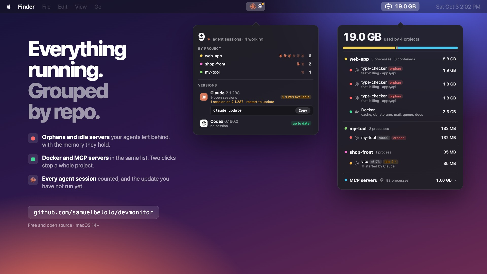

# DevMonitor

A macOS menu bar app for people who run several projects and coding agents at once. It shows
what your dev setup is really running — dev servers, workers, MCP servers, Docker Compose
containers — grouped by git repository, with the memory each one holds, and lets you stop it.
A second item counts your agent sessions and tells you when an agent has a new version.

[](docs/media/demo.mp4)

*Click the image to watch the 23-second demo.*

- [Requirements](#requirements)
- [Install](#install)
- [Use](#use)
- [Safety](#safety)
- [Privacy](#privacy)
- [Limits](#limits)
- [Development](#development)
- [Credits and license](#credits-and-license)

## Requirements

- macOS 14 or later.
- Apple's command line developer tools (`xcode-select --install`): the app is built on your Mac.
- Optional: Docker (Desktop, OrbStack, Colima or Rancher Desktop) for the container rows.
- Optional: one or more coding agents — Claude Code, Codex, Gemini CLI, Cursor Agent, opencode,
  Aider, Amp — for the agents item.

## Install

Paste this in Terminal, without `sudo`:

```bash
curl -fsSL https://raw.githubusercontent.com/samuelbelolo/devmonitor/main/scripts/install.sh | bash
```

It downloads the source, builds the app (about a minute), copies it to `/Applications` (or
`~/Applications`) and launches it. Run the same command again to update.

To start it with your Mac, open the `…` menu of the app and tick **Launch at login**; macOS
lists it under **System Settings → General → Login Items**.

To uninstall, untick **Launch at login**, choose **Quit**, and delete the app.

The app is built locally because it is not notarized by Apple: a downloaded copy would be
blocked by Gatekeeper. From a clone, `make install` does the same.

## Use

**The memory item** (`19.0 GB`) lists one group per repository — worktrees and Compose
containers included — with each service's memory, ports, and two tags: `orphan` (its parent
died) and `idle` (no CPU for 10 minutes). MCP servers have their own collapsed group.

- Cross on a line, then **Confirm**: stops that service and everything it started.
- **Stop**, then **Confirm**, on a project: stops its services and its containers.
- **Stop N idle**, then **Confirm**: stops the idle services counted at the first click.
- A process still running 5 seconds later gets a **Force quit** button.

**The agents item** shows the logo of each agent with its number of open sessions; a Codex item
appears as soon as a Codex session runs. The logo turns while a session works, and an orange
dot means a new version is published. Its window lists:

- the sessions by project, each one marked as working or waiting;
- each installed agent's version, the command to update it (**Copy**), and the sessions still
  running an older version, which need a restart to pick up an update.

## Safety

DevMonitor only signals processes it listed, one by one, after checking each one is still the
same program. It never touches:

- apps and system processes;
- coding agent sessions, and whatever wraps one;
- shells you type in, terminal multiplexers, `ssh`, terminal editors and virtual machine hosts;
- process groups, or a process that changed since the last scan.

It runs as your user, refuses to run as root, and asks for a second click before every stop.
Stopping an MCP server breaks the agent session that uses it, so MCP servers are never part of
**Stop N idle**.

## Privacy

DevMonitor reads your own processes' command lines to name them, on your Mac only, and never
shows the value of an option, a `KEY=value` argument, a URL or a token. Nothing is stored.

The only network requests are the version checks: every 6 hours, the app asks the npm registry
(and PyPI for Aider) for the latest version of each installed agent. Only the package name is
sent. Turn it off in the agents window: `…` → **Check for new versions**.

## Limits

- **Idle means "no CPU"**, not "unused": read the tagged lines before **Stop N idle**.
- A program waiting in a terminal that is not on the protected list (a REPL, `psql`) is listed
  like a server.
- An MCP server whose agent died is recognised by its command name only.
- DevMonitor does not know where Cursor Agent publishes its versions, so its status shows as unknown.
- It is not a security tool: a program can keep out of the list by naming itself like a
  protected one.

## Development

```bash
make run        # build and launch from build/
make test       # run the tests
make dump       # print what the app sees
make snapshot   # render both windows to build/
make help       # every command
```

`Sources/DevMonitorCore` holds the scanning, grouping, stop and version logic; `DevMonitorUI`
the SwiftUI views and stores; `DevMonitorApp` the entry point. Processes are read through
`libproc` (no `ps` or `lsof`), every 3 seconds while a window is open and every 30 seconds
otherwise; Docker through its CLI, against the local socket only.

## Credits and license

The `libproc` code is adapted from [Stray](https://github.com/steppannws/Stray) (MIT, © 2026
Stepan Nikulenko). The logos come from [Simple Icons](https://simpleicons.org); each belongs to
its owner. See [NOTICE.md](NOTICE.md).

[MIT](LICENSE).
